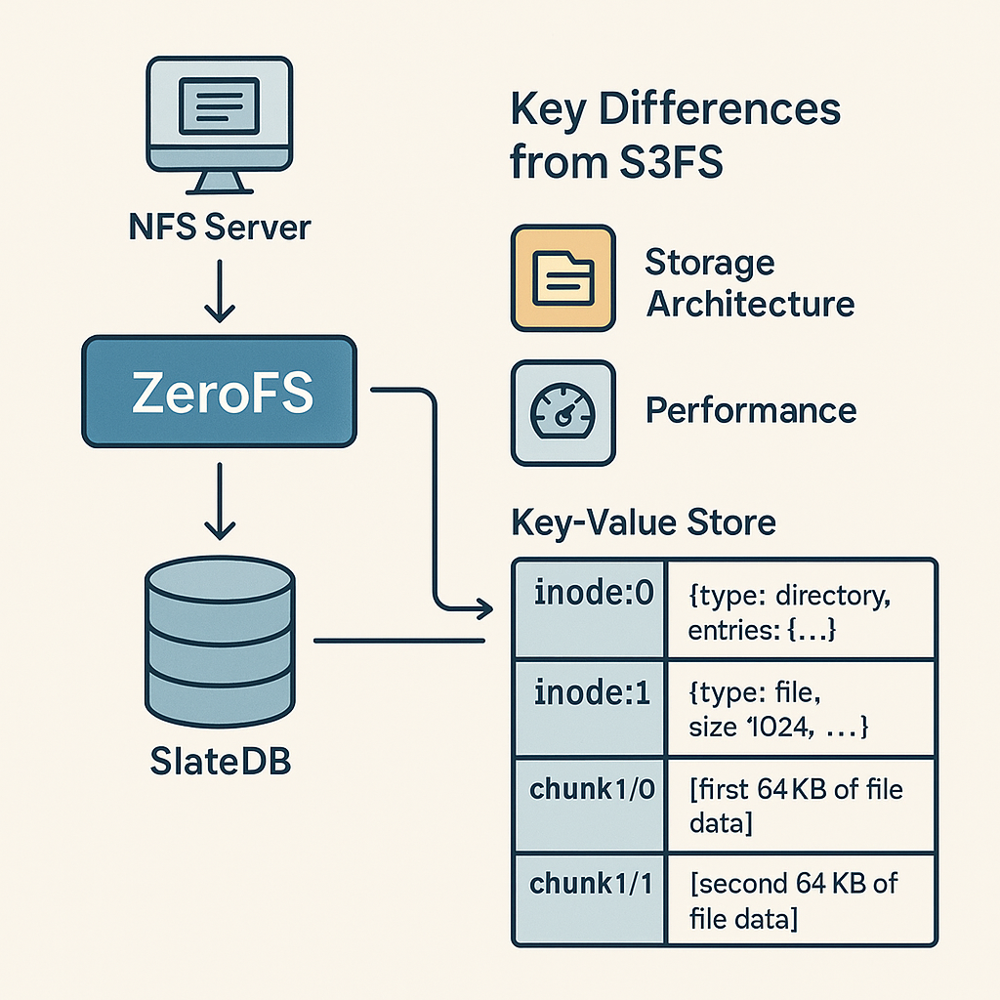

# ZeroFS - The S3FS That Doesn't Suck

ZeroFS makes S3 storage feel like a real filesystem. Built on [SlateDB](https://github.com/slatedb/slatedb), it's fast enough to compile code on and works with the NFS client already built into your OS. No FUSE drivers, no kernel modules, just mount and go.

<p align="center">
  
</p>

## Demo

<p align="center">
  <a href="https://asciinema.org/a/idv3T3klsE6FzKqve2vSGav92" target="_blank"></a>
</p>

### Self-Hosting ZeroFS

ZeroFS can self-host! Here's a demo showing Rust's toolchain building ZeroFS while running on ZeroFS:

<p align="center">
<a href="https://asciinema.org/a/728101" target="_blank"></a>
</p>

## Configuration

### Required Environment Variables

- `SLATEDB_CACHE_DIR`: Directory path for caching data (required)
- `SLATEDB_CACHE_SIZE_GB`: Cache size in gigabytes (required, must be a positive number)

### Optional Environment Variables

- `AWS_ENDPOINT_URL`: S3-compatible endpoint URL
- `AWS_S3_BUCKET`: S3 bucket name (default: "slatedb")
- `AWS_ACCESS_KEY_ID`: AWS access key ID
- `AWS_SECRET_ACCESS_KEY`: AWS secret access key
- `AWS_DEFAULT_REGION`: AWS region (default: "us-east-1")
- `AWS_ALLOW_HTTP`: Allow HTTP connections (default: "false")

## Mounting the Filesystem

### macOS
```bash
mount -t nfs -o nolocks,vers=3,tcp,port=2049,mountport=2049,soft 127.0.0.1:/ mnt
```

### Linux
```bash
mount -t nfs -o vers=3,nolock,tcp,port=2049,mountport=2049,soft 127.0.0.1:/ /mnt
```

## Key Differences from S3FS

### 1. **Storage Architecture**

**S3FS:**
- Maps filesystem operations directly to S3 object operations
- Each file is typically stored as a single S3 object
- Directories are often represented as zero-byte objects with trailing slashes
- Metadata stored in S3 object headers or separate metadata objects

**ZeroFS:**
- Uses SlateDB, a log-structured merge-tree (LSM) database
- Files are chunked into 64KB blocks for efficient partial reads/writes
- Inodes and file data stored as key-value pairs
- Metadata is first-class data in the database

### 2. **Performance Characteristics**

**S3FS:**
- High latency for small file operations (S3 API overhead)
- Poor performance for partial file updates (must rewrite entire object)
- Directory listings can be slow (S3 LIST operations)
- No real atomic operations across multiple files

**ZeroFS:**
- Optimized for small, random I/O operations
- Efficient partial file updates through chunking
- Fast directory operations using B-tree indexes
- Atomic batch operations through SlateDB's WriteBatch

### 3. **Data Layout**

**S3FS Layout:**
```
s3://bucket/
├── file1.txt (complete file as single object)
├── dir1/ (zero-byte marker)
├── dir1/file2.txt (complete file)
└── .metadata/ (optional metadata storage)
```

**ZeroFS Layout (in SlateDB):**
```
Key-Value Store:
├── inode:0 → {type: directory, entries: {...}}
├── inode:1 → {type: file, size: 1024, ...}
├── chunk:1/0 → [first 64KB of file data]
├── chunk:1/1 → [second 64KB of file data]
└── next_inode_id → 2
```

### 5. **Cost Model**

**S3FS:**
- Costs scale with number of API requests
- Full file rewrites expensive for small changes
- LIST operations can be costly for large directories

**ZeroFS:**
- Costs amortized through SlateDB's compaction
- Efficient small updates reduce write amplification
- Predictable costs through batching

## Why NFS?

We chose NFS because it's supported everywhere - macOS, Linux, Windows, BSD - without requiring any additional software. The client-side kernel implementation is highly optimized, while our server can remain in userspace with full control over the storage backend.

NFS's network-first design is a natural fit for remote object storage. The protocol handles disconnections, retries, and caching in ways that have been refined over decades of production use. Multi-client access, load balancing, and high availability are built into the ecosystem.

With FUSE, we'd need to write both the filesystem implementation and a custom client driver to handle S3's network characteristics properly - latency, retries, caching strategies. NFS lets us focus on what matters: building a great filesystem. The networking, caching, and client-side concerns are handled by battle-tested NFS implementations in every OS kernel.

For developers, this means you can mount ZeroFS using standard OS tools, monitor it with existing infrastructure, and debug issues with familiar utilities. It just works.

## Future Enhancements

- [ ] Snapshot capabilities using SlateDB's checkpoints

